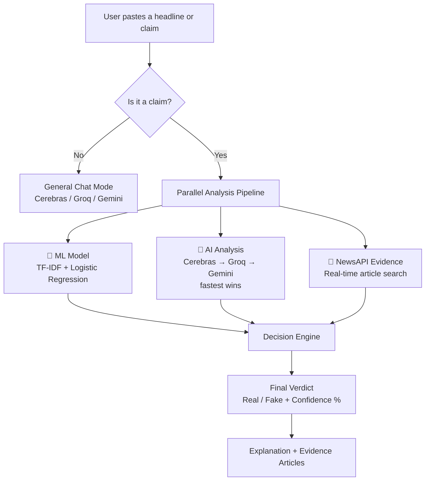
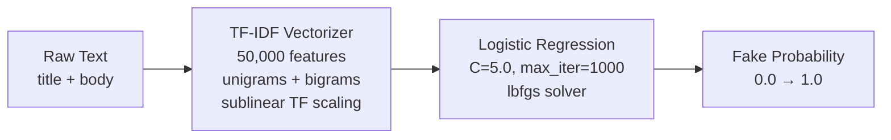
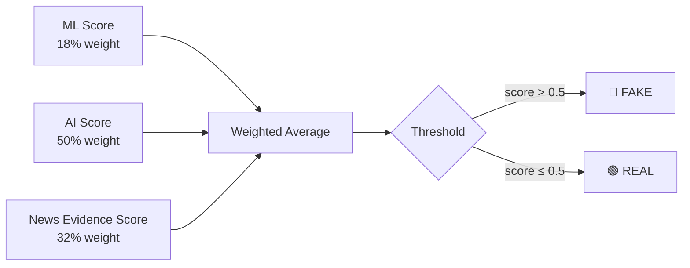
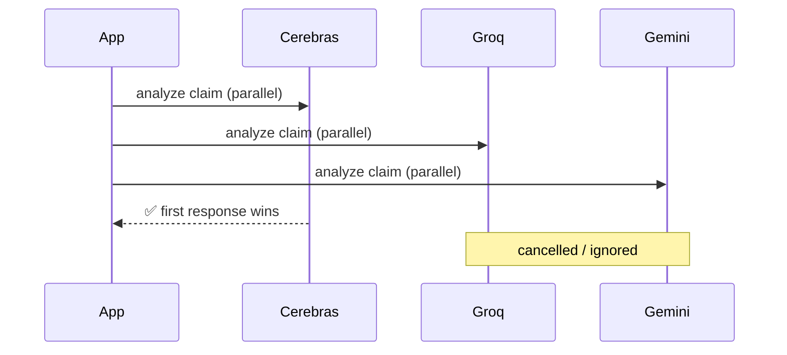

<p align="center">
  
</p>

<h1 align="center">FactChecker AI</h1>

<p align="center">A Chrome extension that detects fake news in real time using a custom-trained ML model combined with multi-provider AI analysis and live news evidence.</p>

---

## How It Works



---

## The ML Model — Core of the System

This is the heart of FactChecker AI. We trained a custom **TF-IDF + Logistic Regression** classifier on a merged dataset of ~98,000 real-world news articles.

### Training Data

| Dataset | Source | Rows | Label Format |
|---|---|---|---|
| Fake.csv + True.csv | LIAR / WELFake | 44,898 | filename (Fake=1, True=0) |
| fake_news_dataset_44k.csv | Kaggle | 44,898 | 0 / 1 |
| fake_news_dataset_20k.csv | Kaggle | 20,000 | "fake" / "real" |
| **Total after dedup** | — | **97,721** | — |

### Model Architecture



### Training Results

```
📊 Total samples:  97,721
   Fake:           45,390
   Real:           52,331

🎯 Test Accuracy:  90%

              precision    recall    f1-score
   Real          0.90       0.91       0.91
   Fake          0.89       0.89       0.89
```

### Why TF-IDF + Logistic Regression?

- Fast inference — no GPU needed, runs on Render free tier
- Interpretable — you can inspect feature weights
- Bigrams capture phrases like "breaking news", "sources say", "officials claim"
- 50k features vs the typical 3k gives much richer vocabulary coverage
- 90% accuracy is competitive with many deep learning approaches on this task

### Retrain the Model

```bash
# Add new CSVs to backend/training/ then:
cd fake-news-extension
backend\venv\Scripts\python.exe backend\training\train.py

# Commit the updated model
git add backend/data/model.joblib backend/data/vectorizer.joblib
git commit -m "retrain: updated model"
git push
```

Supported CSV formats the training script handles automatically:

| File | Required Columns |
|---|---|
| `Fake.csv` + `True.csv` | `title`, `text` (label from filename) |
| `fake_news_dataset_44k.csv` | `text`, `label` (0/1) |
| `fake_news_dataset_20k.csv` | `title`, `text`, `label` (fake/real) |

---

## Decision Engine

The final verdict combines all three signals with weighted scoring:



| Signal | Weight | Source |
|---|---|---|
| ML Model | 18% | Local TF-IDF classifier |
| AI Analysis | 50% | Cerebras / Groq / Gemini |
| News Evidence | 32% | NewsAPI live search |

---

## AI Provider Race

Three AI providers run in parallel. The first to respond wins — giving the fastest possible result with automatic fallback.



---

## Project Structure

```
fake-news-extension/
├── backend/
│   ├── app/
│   │   ├── analysis/
│   │   │   ├── ai.py           # Cerebras + Groq + Gemini parallel
│   │   │   ├── chat.py         # Chat mode + claim detection
│   │   │   ├── evidence.py     # NewsAPI evidence fetching
│   │   │   ├── explain.py      # Keyword extractor
│   │   │   └── ml.py           # Model loader + inference
│   │   ├── logic/
│   │   │   └── decision.py     # Weighted verdict logic
│   │   ├── routes/
│   │   │   ├── auth_routes.py  # Signup, login, Google OAuth, OTP reset
│   │   │   └── history_routes.py
│   │   ├── api.py              # /message endpoint (parallel pipeline)
│   │   ├── auth.py             # JWT + Google OAuth helpers
│   │   ├── email_utils.py      # Brevo HTTP API email
│   │   ├── main.py             # FastAPI app + lifespan
│   │   ├── models.py           # SQLAlchemy ORM models
│   │   └── schemas.py          # Pydantic request/response schemas
│   ├── data/
│   │   ├── model.joblib        # Trained classifier (committed to git)
│   │   └── vectorizer.joblib   # TF-IDF vectorizer (committed to git)
│   ├── training/
│   │   ├── train.py            # Training script (multi-dataset merge)
│   │   ├── Fake.csv            # gitignored — add locally
│   │   ├── True.csv            # gitignored — add locally
│   │   ├── fake_news_dataset_44k.csv  # gitignored
│   │   └── fake_news_dataset_20k.csv  # gitignored
│   ├── database.py             # SQLAlchemy engine (SQLite + PostgreSQL)
│   ├── requirements.txt
│   ├── Procfile
│   └── runtime.txt
├── extension/
│   ├── background/
│   │   └── service_worker.js   # Context menu + popup launcher
│   ├── popup/
│   │   ├── config.js           # API base URL (single source of truth)
│   │   ├── shared.css          # Full design system
│   │   ├── popup.html/js       # Main chat + fact-check interface
│   │   ├── login.html/js       # Email/password + Google OAuth
│   │   ├── dashboard.html/js   # Stats overview
│   │   ├── history.html/js     # Chat session history
│   │   ├── saved.html/js       # Saved claims
│   │   ├── settings.html/js    # Profile + preferences
│   │   └── detail.html/js      # Full claim detail view
│   ├── content.js              # Context menu text selection
│   └── manifest.json           # Chrome MV3 manifest
├── render.yaml                 # Render deployment config
└── README.md
```

---

## Tech Stack

| Layer | Technology |
|---|---|
| Extension | Vanilla JS, Chrome Manifest V3 |
| UI | Custom CSS design system |
| Backend | FastAPI + Python 3.11 |
| Database | PostgreSQL (Render) / SQLite (local) |
| ML | scikit-learn — TF-IDF + Logistic Regression |
| AI | Cerebras, Groq, Gemini (parallel race) |
| News | NewsAPI |
| Auth | JWT + Google OAuth 2.0 |
| Email | Brevo HTTP API |
| Deploy | Render (web service + PostgreSQL) |

---

## Local Setup

### 1. Clone

```bash
git clone https://github.com/chandu1234678/fake-news-analyzer.git
cd fake-news-analyzer
```

### 2. Backend

```bash
cd backend
py -m venv venv
venv\Scripts\activate        # Windows
pip install -r requirements.txt
```

### 3. Environment variables

```bash
copy .env.example .env
```

Fill in `backend/.env`:

```env
CEREBRAS_API_KEY=your_key
GROQ_API_KEY=your_key
GEMINI_API_KEY=your_key
NEWS_API_KEY=your_key
DATABASE_URL=sqlite:///./fake_news.db
JWT_SECRET=any-long-random-string-32-chars-min
GOOGLE_CLIENT_ID=your_chrome_extension_oauth_client_id
BREVO_API_KEY=your_brevo_key
SMTP_USER=your_verified_sender@gmail.com
```

### 4. Add training data and train the model

Drop the CSV files into `backend/training/` (see table above), then:

```bash
backend\venv\Scripts\python.exe backend\training\train.py
```

Expected output:
```
✅ Dataset 1 (Fake+True): 44898 rows
✅ Dataset 2 (44k): 44898 rows
✅ Dataset 3 (20k): 20000 rows

📊 Total samples after merge+dedup: 97721
🎯 Test accuracy: 0.8989
✅ Model & vectorizer saved to backend/data/
```

### 5. Run the backend

```bash
uvicorn app.main:app --reload
```

Visit `http://127.0.0.1:8000/health` → `{"status":"ok"}`

### 6. Load the extension

1. Chrome → `chrome://extensions`
2. Enable Developer mode
3. Load unpacked → select `extension/` folder

Set `extension/popup/config.js` to `http://127.0.0.1:8000` for local dev.

---

## Deploy to Render

### 1. Create PostgreSQL on Render

New → PostgreSQL → Free → copy the **Internal Database URL**

### 2. Create Web Service

New → Web Service → connect GitHub repo

| Setting | Value |
|---|---|
| Root directory | `backend` |
| Build command | `pip install -r requirements.txt` |
| Start command | `gunicorn app.main:app -w 2 -k uvicorn.workers.UvicornWorker --bind 0.0.0.0:$PORT --timeout 120` |
| Health check path | `/health` |

### 3. Set environment variables

Add all keys from `.env` plus `DATABASE_URL` = your PostgreSQL Internal URL.

### 4. Push and deploy

```bash
git add .
git commit -m "deploy"
git push
```

Tables are auto-created on first startup via `Base.metadata.create_all()`.

---

## Keep Render Awake

Render free tier sleeps after 15 min of inactivity. Use [UptimeRobot](https://uptimerobot.com):

- Monitor type: `HTTP(s)`
- URL: `https://your-service.onrender.com/health`
- Interval: `5 minutes`

---

## API Reference

| Method | Endpoint | Description |
|---|---|---|
| GET/HEAD | `/health` | Health check |
| POST | `/auth/signup` | Register with email + password |
| POST | `/auth/login` | Login with email + password |
| POST | `/auth/google` | Google OAuth |
| GET | `/auth/me` | Get current user |
| POST | `/auth/forgot-password` | Send OTP to email |
| POST | `/auth/reset-password` | Verify OTP + set new password |
| POST | `/message` | Fact-check a claim or chat |
| GET | `/history/sessions` | List chat sessions |
| POST | `/history/sessions` | Create session |
| DELETE | `/history/sessions/{id}` | Delete session |
| GET | `/history/sessions/{id}/messages` | Get session messages |

---

## Environment Variables

| Variable | Where to get it |
|---|---|
| `CEREBRAS_API_KEY` | [cerebras.ai](https://cerebras.ai) |
| `GROQ_API_KEY` | [console.groq.com](https://console.groq.com) |
| `GEMINI_API_KEY` | [aistudio.google.com](https://aistudio.google.com) |
| `NEWS_API_KEY` | [newsapi.org](https://newsapi.org) |
| `DATABASE_URL` | Render PostgreSQL internal URL |
| `JWT_SECRET` | Any random 32+ char string |
| `GOOGLE_CLIENT_ID` | Google Cloud Console → Chrome extension OAuth client |
| `BREVO_API_KEY` | [brevo.com](https://brevo.com) |
| `SMTP_USER` | Verified sender email in Brevo |

---

## Common Issues

**`No open HTTP ports detected` on Render**
- Usually means the app crashed on startup — check Render logs
- Most common cause: `DATABASE_URL` env var not set or wrong

**Google sign-in not working on Kiwi Browser**
- Create a "Web application" OAuth client in Google Cloud Console
- Add `https://YOUR_EXTENSION_ID.chromiumapp.org/oauth2` to redirect URIs

**ML model missing on Render**
- The `.joblib` files must be committed to git — Render doesn't run `train.py`
- Run training locally, `git add backend/data/*.joblib`, commit and push

**OTP email not arriving**
- Check `BREVO_API_KEY` and `SMTP_USER` are set on Render
- Verify the sender email is confirmed in your Brevo account

---

*Built with Python, curiosity, and a healthy distrust of headlines.*